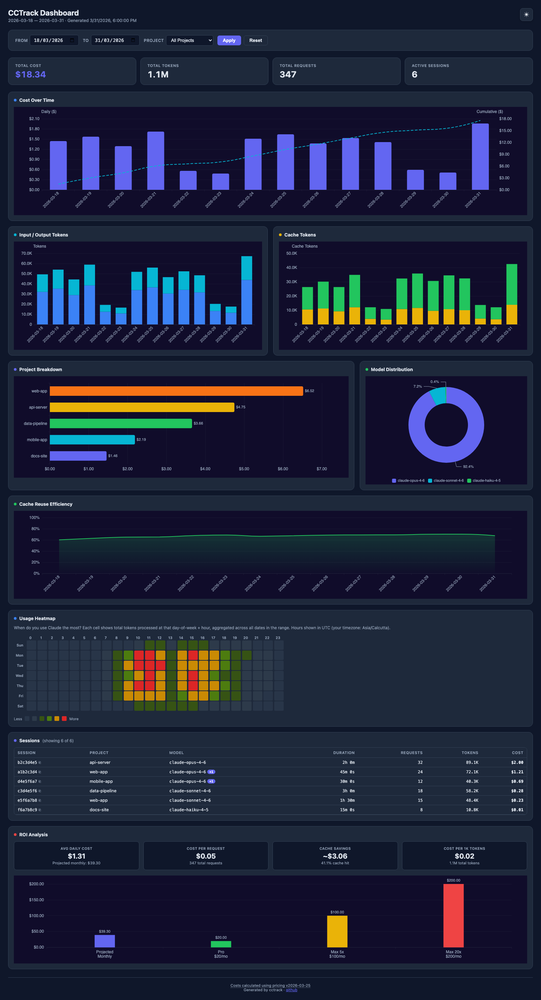
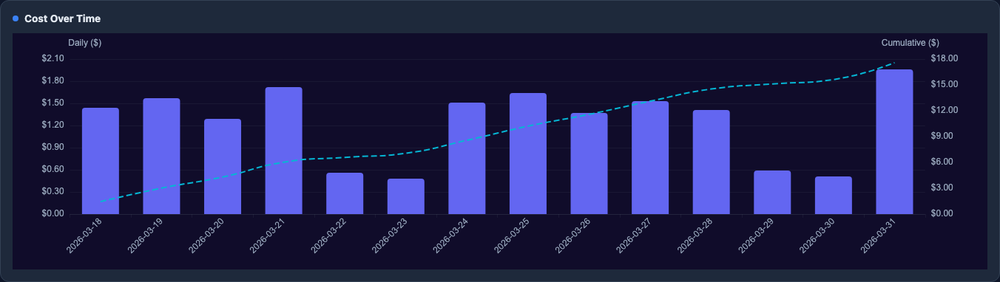
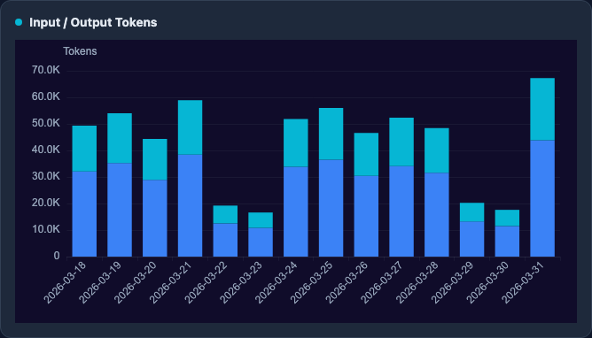
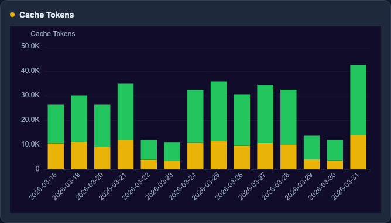
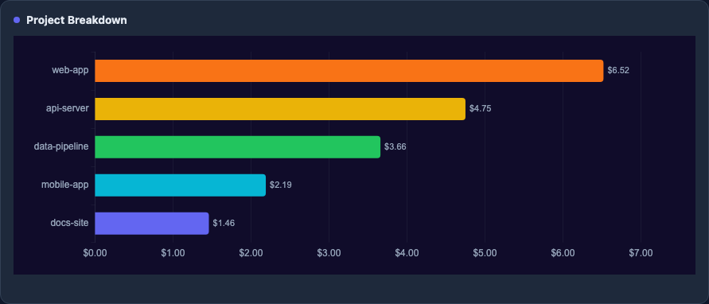
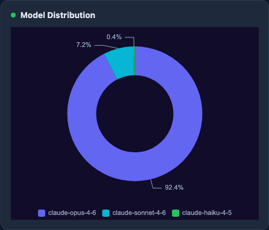
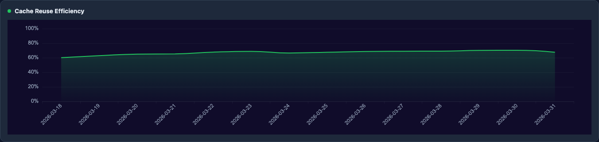
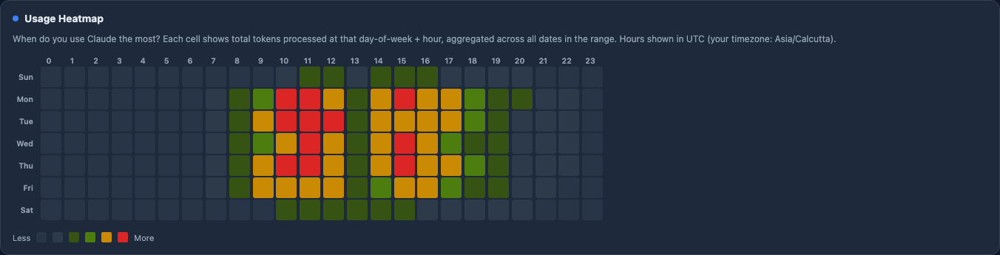
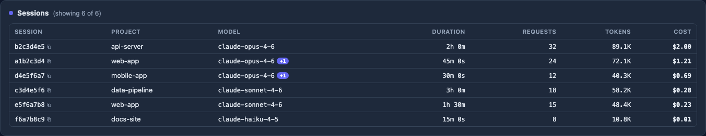
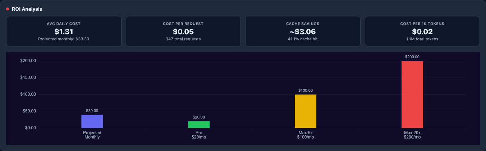

# cctrack

[](https://github.com/azharuddinkhan3005/cctrack/actions/workflows/ci.yml)
[](https://www.npmjs.com/package/cctrackr)
[](https://www.npmjs.com/package/cctrackr)
[](https://github.com/azharuddinkhan3005/cctrack/blob/main/LICENSE)
[](https://nodejs.org)

Know exactly what Claude Code costs you. Accurate token tracking, cost breakdowns, and a beautiful interactive dashboard -- all from your local JSONL logs.

## What It Does

cctrack reads Claude Code's local usage logs and turns them into actionable analytics. It deduplicates requests, applies Anthropic's tiered pricing, and gives you cost breakdowns by day, session, project, and model -- in the terminal or as an interactive HTML dashboard.

<p align="center">
  
</p>

## Features

- **Accurate cost calculation** -- 3-tier deduplication (requestId > messageId > content hash) eliminates double-counting. Tiered pricing applies Anthropic's rate change at the 200K token threshold.
- **14 Anthropic models, 24 aliases** -- Covers every Claude model. Dynamic pricing fetches current rates from Anthropic's public page, with bundled fallback if offline.
- **Interactive HTML dashboard** -- 9 chart panels, project/date filters, dark/light mode. Self-contained HTML file you can share or archive.
- **Per-project breakdown** -- Automatically resolves project names from the filesystem directory structure, including subagent paths that point back to parent projects.
- **Budget alerts** -- 4-level system (safe / warning / critical / exceeded) with configurable daily and monthly budgets.
- **Burn rate projections** -- Hourly, daily, and monthly burn rates with projected month-end spend, suppressed when data is insufficient (< 1 hour).
- **5-hour window tracking** -- Usage grouped into time windows to help you see consumption patterns across the day.
- **ROI calculator** -- Compares your API-equivalent cost against Pro ($20/mo), Max 5x ($100/mo), and Max 20x ($200/mo) plans with fuzzy plan name matching.
- **Real-time monitor** -- Live terminal display that refreshes every few seconds with current session cost and burn rate.
- **Rate limit intelligence** -- Tracks billable tokens (input + cache_creation only, NOT cache_read) and includes an EMA-based predictive model.
- **Multiple output formats** -- `--json` on all commands, `--csv` on daily/monthly/session for spreadsheet export.
- **Statusline integration** -- One-line output designed for tmux status bars and editor integrations, with optional stdin rate limit data from Claude Code.
- **Session Detail View** -- Drill into any session to see per-request cost breakdown with model, token counts, and timing.
- **Agent/Subagent Hierarchy** -- See all subagents spawned in a session with their type and description.
- **Data Preservation** -- Automatic caching survives Claude Code's 30-day log deletion. Your historical data is never lost.
- **Pricing Snapshots** -- Historical costs stay accurate even after Anthropic changes their prices.
- **MCP Server** -- Claude Desktop integration via Model Context Protocol with 7 tools for querying usage data.
- **Zero data collection** -- All processing is local. No telemetry, no server, no account required.

## Quick Start

```bash
npx cctrackr@latest
```

That's it. Your dashboard opens in the browser with your full usage history.

To install globally:

```bash
npm install -g cctrackr
```

## Dashboard Panels

The dashboard is a self-contained HTML file with 9 interactive panels. No server needed -- open it locally or share the file.

- **Dark / light mode** -- Toggle with the button in the top-right corner. Charts rebuild with correct theme colors.
- **Live filtering** -- Date range and project filters auto-apply on change (no need to click Apply). All panels update together.
- **Responsive** -- Adapts to desktop, tablet, and mobile viewports with proper breakpoints at 1024px, 768px, and 480px.
- **Print-ready** -- Charts convert to static images before printing so they render correctly on paper.
- **Accessible** -- ARIA labels on all chart containers, screen-reader-friendly data tables.

### Cost Over Time



Daily spend as bars with a cumulative cost trendline. Spot spending spikes and trends at a glance.

### Input / Output Tokens



Input vs. output token volume per day. See how much you're sending versus receiving.

### Cache Tokens



Cache write vs. cache read volume over time. High cache reads relative to writes means you're getting good prompt caching value.

### Project Breakdown



Cost per project as a horizontal bar chart. Instantly see which projects consume the most.

### Model Distribution



Spend split by model. Understand how your costs divide across Opus, Sonnet, Haiku, and others.

### Cache Reuse Efficiency



Cache hit rate over time. Track whether your workflows are effectively reusing cached prompts.

### Usage Heatmap



Hour-of-day by day-of-week activity map. See when you use Claude Code the most.

### Sessions



Sortable table of every session with project, model, duration, request count, tokens, and cost.

### ROI Analysis



Compares your projected monthly cost against Pro, Max 5x, and Max 20x subscription plans so you can see which plan gives you the best value.

## CLI Commands

| Command | Description |
|---|---|
| `cctrackr` | Open interactive HTML dashboard (default) |
| `cctrackr daily` | Daily usage breakdown with cost sparklines |
| `cctrackr monthly` | Monthly aggregated view |
| `cctrackr session` | Per-session breakdown with project and model |
| `cctrackr session <id>` | Per-request detail for a specific session |
| `cctrackr blocks` | Usage grouped by 5-hour windows |
| `cctrackr roi` | ROI analysis vs subscription plans |
| `cctrackr live` | Real-time terminal monitor with burn rate |
| `cctrackr statusline` | Compact one-line output for tmux/editors |
| `cctrackr limits` | Rate limit analysis (billable token tracking) |
| `cctrackr export csv` | Export per-request data as CSV |
| `cctrackr export json` | Export structured JSON |
| `cctrackr pricing list` | View all model prices |
| `cctrackr mcp` | Start MCP server for Claude Desktop |
| `cctrackr config` | Manage budgets and settings |

## Command Details

### `cctrackr dashboard`

Opens an interactive HTML dashboard in your browser. The HTML file is self-contained -- no server needed. You can save it, share it, or archive it.

```bash
cctrackr dashboard                        # Open in browser
cctrackr dashboard --save report.html     # Save to file without opening
cctrackr dashboard --json                 # Output raw dashboard data as JSON
cctrackr dashboard --project my-app       # Pre-filter to a specific project
cctrackr dashboard --since 2026-03-01     # Filter from a date
```

### `cctrackr roi`

Compares your actual API-equivalent cost against subscription plans. Supports fuzzy plan names:

```bash
cctrackr roi                    # Default: compare against all plans
cctrackr roi --plan pro         # Compare against Pro ($20/mo)
cctrackr roi --plan max5        # Compare against Max 5x ($100/mo)
cctrackr roi --plan 200         # Fuzzy: "200" resolves to Max 20x
cctrackr roi --plan max         # Fuzzy: "max" resolves to Max 5x
cctrackr roi --json             # Machine-readable output
```

### `cctrackr live`

Real-time terminal monitor that refreshes every few seconds. Shows today's cost, burn rate, and budget status. Press Ctrl+C to exit.

```bash
cctrackr live                       # Default refresh every 5 seconds
cctrackr live --interval 10         # Refresh every 10 seconds
cctrackr live --project my-app      # Monitor a specific project
cctrackr live --mode display        # Use Claude Code's cost estimates
```

### `cctrackr blocks`

Groups usage into 5-hour time windows to reveal consumption patterns. Also displays weekly rate limit windows and extra usage credit data when available (from statusline hook).

```bash
cctrackr blocks                       # Current window and recent history
cctrackr blocks --json                # Machine-readable output
cctrackr blocks --live                # Auto-refresh every 5 seconds
cctrackr blocks --since 2026-03-25    # Filter by date range
```

### `cctrackr session <id>`

Drill into a specific session to see every request with its model, token breakdown, and cost. Useful for understanding exactly where spend went within a long session.

```bash
cctrackr session a1b2c3d4              # Per-request detail for session
cctrackr session a1b2c3d4 --hierarchy  # Show agent/subagent hierarchy
cctrackr session a1b2c3d4 --json       # Machine-readable output
cctrackr session a1b2c3d4 --limit 500  # Show up to 500 requests (default: 100)
```

### `cctrackr mcp`

Starts an MCP (Model Context Protocol) server so Claude Desktop can query your usage data directly. The server exposes 7 tools:

- `get_daily_usage` -- Daily cost and token breakdown
- `get_session_list` -- All sessions with cost summary
- `get_session_detail` -- Per-request detail for a session
- `get_budget_status` -- Current daily/monthly budget status
- `get_roi_analysis` -- ROI comparison against subscription plans
- `get_rate_limits` -- Burn rate and rate limit predictions
- `get_dashboard_data` -- Complete dashboard dataset with all aggregations

**Claude Desktop config** (using global install):

```json
{
  "mcpServers": {
    "cctrackr": {
      "command": "cctrackr-mcp"
    }
  }
}
```

**Claude Desktop config** (using npx):

```json
{
  "mcpServers": {
    "cctrackr": {
      "command": "npx",
      "args": ["cctrackr@latest", "mcp"]
    }
  }
}
```

### `cctrackr limits`

Analyzes rate limit consumption using billable tokens only (input + cache_creation, excluding cache_read).

```bash
cctrackr limits                 # Terminal summary
cctrackr limits --json          # Detailed JSON with prediction model
```

### `cctrackr statusline`

Designed to be piped into tmux or editor status bars. Ultra-fast with a 30-second cache for repeated calls.

```bash
cctrackr statusline                                 # One-line summary
cctrackr statusline --json                          # Structured JSON for scripts
cctrackr statusline --format '{cost} | {model}'     # Custom format
cctrackr statusline --no-cache                      # Force fresh parse
```

**Custom format placeholders:** `{cost}`, `{model}`, `{tokens}`, `{block_pct}`, `{block_remaining}`

To use as a Claude Code statusline hook (receives real rate limit data from stdin), add to `.claude/settings.json`:

```json
{
  "statusline": "cctrackr statusline"
}
```

When configured as a hook, cctrack receives rate limit data (`used_percentage`, `resets_at`, weekly windows, extra usage credits) directly from Claude Code's stdin. This data is persisted to `~/.cctrack/ratelimits.json` and shared with `blocks` and `live` commands.

### `cctrackr export`

Export raw per-request data for external analysis:

```bash
cctrackr export csv                           # CSV to stdout
cctrackr export csv > usage.csv               # Save to file
cctrackr export json                          # Full dashboard JSON
cctrackr export csv --since 2026-03-01        # Date-filtered export
cctrackr export csv --project my-app          # Project-filtered export
```

### Cost Modes

The `--mode` flag controls how costs are calculated:

| Mode | Description |
|---|---|
| `calculate` | Default. Computes cost from tokens using Anthropic's pricing |
| `display` | Uses the `costUSD` field from JSONL entries (Claude Code's own estimate) |
| `compare` | Shows both calculated and display costs side by side |

```bash
cctrackr daily --mode display    # Use Claude Code's cost estimates
cctrackr daily --mode compare    # Compare both methods
```

## Terminal Output Examples

**Daily breakdown:**

```
$ cctrackr daily

┌────────────┬────────┬────────┬─────────────┬────────────┬────────┬──────────────────┐
│ Date       │  Input │ Output │ Cache Write │ Cache Read │  Total │             Cost │
├────────────┼────────┼────────┼─────────────┼────────────┼────────┼──────────────────┤
│ 2026-03-25 │  12.3K │  45.6K │        1.8M │     156.2M │ 158.1M │  $92.45 ████████ │
│ 2026-03-26 │   8.1K │  32.4K │        1.2M │      98.7M │  99.9M │  $58.30 █████░░░ │
└────────────┴────────┴────────┴─────────────┴────────────┴────────┴──────────────────┘
Daily Budget: ████████████░░░░░░░░ 58% ($58.30 / $100.00)
────────────────────────────────────────────────────────────
Total: 258.0M tokens, $150.75
Burn rate: $3.14/hr, $75.38/day → projected $2261.25/month
```

**Session view:**

```
$ cctrackr session

┌─────────────────┬─────────────┬─────────────┬──────────┬──────────┬────────┬─────────┐
│ Session ID      │ Project     │ Model       │ Duration │ Requests │ Tokens │    Cost │
├─────────────────┼─────────────┼─────────────┼──────────┼──────────┼────────┼─────────┤
│ a1b2c3d4-e5f... │ my-app      │ opus-4.6    │  18h 30m │      620 │ 210.5M │ $122.40 │
│ f6e5d4c3-b2a... │ my-api      │ sonnet-4.6  │   8h 15m │      195 │  47.5M │  $28.35 │
└─────────────────┴─────────────┴─────────────┴──────────┴──────────┴────────┴─────────┘
2 sessions, 815 requests, 258.0M tokens, $150.75
```

**Session detail:**

```
$ cctrackr session a1b2c3d4

Session: a1b2c3d4-e5f6-7890-abcd-ef1234567890
Project: my-app
Model: opus-4.6
Duration: 18h 30m
Total: 210.5M tokens, $122.40

┌──────────┬──────────┬───────┬────────┬─────────┬─────────┬─────────┐
│ Time     │ Model    │ Input │ Output │ Cache W │ Cache R │    Cost │
├──────────┼──────────┼───────┼────────┼─────────┼─────────┼─────────┤
│ 09:15:32 │ opus-4.6 │  1.2K │   3.4K │    180K │     12M │   $0.19 │
│ 09:16:01 │ opus-4.6 │  0.8K │   2.1K │     95K │     12M │   $0.12 │
│ 09:17:45 │ opus-4.6 │  2.3K │   4.2K │    128K │     12M │   $0.16 │
└──────────┴──────────┴───────┴────────┴─────────┴─────────┴─────────┘
Showing 3 of 620 requests. Use --limit to show more.
```

**Agent hierarchy:**

```
$ cctrackr session a1b2c3d4 --hierarchy

Session: a1b2c3d4-e5f6-...
Project: my-app
Total: 210.5M tokens, $122.40, 620 requests

┌──────────────────┬─────────────────┬──────────────────────────┬──────────┬────────┬─────────┬────────────┐
│ Agent            │ Type            │ Description              │ Requests │ Tokens │    Cost │ % of Total │
├──────────────────┼─────────────────┼──────────────────────────┼──────────┼────────┼─────────┼────────────┤
│ (parent session) │                 │                          │      620 │ 210.5M │ $122.40 │     100.0% │
│ b2c3d4e5f6a7b... │ code-reviewer   │ Review auth module       │        0 │      0 │   $0.00 │       0.0% │
│ c3d4e5f6a7b8c... │ testing-agent   │ Write integration tests  │        0 │      0 │   $0.00 │       0.0% │
└──────────────────┴─────────────────┴──────────────────────────┴──────────┴────────┴─────────┴────────────┘

Note: Claude Code logs API usage under the parent session.
      Per-agent cost attribution is not available from JSONL data.
```

**Statusline (for tmux or editor status bars):**

```
$ cctrackr statusline
$58.30 today │ opus-4.6 │ 99.9M tok │ █████░░░ 52% 5h (2h 15m)
```

**ROI analysis:**

```
$ cctrackr roi --plan max5

ROI Analysis (max5 plan)
────────────────────────
Total tokens:      258.0M
API equivalent:    $150.75
Subscription:      $100.00/mo
Savings:           $50.75 (33.7%)
Projected monthly: $2261.25
```

**Blocks view:**

```
$ cctrackr blocks

┌───────────────────┬──────────┬──────────┬────────┐
│ Window            │ Requests │   Tokens │   Cost │
├───────────────────┼──────────┼──────────┼────────┤
│ 10:00 — 15:00     │      142 │   48.2M  │ $28.10 │
│ 15:00 — 20:00     │       98 │   31.5M  │ $18.40 │
└───────────────────┴──────────┴──────────┴────────┘
```

## Options

**Global flags** (supported by most commands):

| Flag | Description | Available on |
|---|---|---|
| `--since YYYY-MM-DD` | Filter from date | daily, monthly, session, blocks, dashboard, export, roi, live |
| `--until YYYY-MM-DD` | Filter to date | daily, monthly, session, blocks, dashboard, export, roi, live |
| `--project <name>` | Filter by project | daily, monthly, session, dashboard, export, live |
| `--mode <mode>` | Cost mode: `calculate` (default), `display`, `compare` | daily, monthly, session, blocks, dashboard, export, roi, live, statusline, limits |
| `--timezone <tz>` | Timezone for date grouping (e.g. `America/New_York`) | daily, monthly, session, dashboard, export, roi, live |
| `--json` | Output as JSON | daily, monthly, session, blocks, dashboard, roi, live, statusline, limits, pricing, export |
| `--csv` | Output as CSV | daily, monthly, session |
| `--breakdown` | Show per-model breakdown | daily, monthly |

**Command-specific flags:**

| Flag | Command | Description |
|---|---|---|
| `--save <path>` | dashboard | Save HTML to file without opening browser |
| `--interval <sec>` | live | Refresh interval in seconds (default: 5) |
| `--live` | blocks | Auto-refresh every 5 seconds |
| `--full` | session | Show full session IDs and project names (no truncation) |
| `--format <tpl>` | statusline | Custom format: `{cost}`, `{model}`, `{tokens}`, `{block_pct}`, `{block_remaining}` |
| `--no-cache` | statusline | Force fresh parse, skip 30-second cache |
| `--plan <name>` | roi | Plan to compare: `pro`, `max5`, `max20` (fuzzy: `20`, `100`, `200`, `max`) |
| `--hierarchy` | session | Show agent/subagent hierarchy for a specific session |
| `--limit <n>` | session | Max requests in detail view (default: 100) |

## Budget Alerts

Set daily or monthly spending budgets:

```bash
cctrackr config set budget.daily 100
cctrackr config set budget.monthly 2000
```

The `daily` and `live` commands show a color-coded progress bar:

```
Daily Budget: ████████████░░░░░░░░ 62% ($62.00 / $100.00)
```

| Level | Threshold | Color |
|---|---|---|
| Safe | < 50% | Green |
| Warning | 50 -- 80% | Yellow |
| Critical | 80 -- 100% | Red |
| Exceeded | > 100% | Red (flashing) |

## Pricing

cctrack maintains accurate per-token pricing for all 14 Anthropic models:

```bash
cctrackr pricing list           # View all model prices
cctrackr pricing status         # Check pricing source and freshness
cctrackr pricing update         # Force-fetch latest prices from Anthropic
cctrackr pricing list --json    # Machine-readable pricing data
```

Pricing works in two tiers:

- **Standard rate** -- Applied to the first 200K input tokens per request
- **Tiered rate** -- Applied to input tokens beyond 200K (typically discounted)

Prices are fetched from Anthropic's public pricing page and cached locally at `~/.cctrack/pricing.json` (refreshed every 24 hours). If the fetch fails, cctrack falls back to bundled pricing data shipped with the package.

Each cost calculation captures the exact rates used at the time, so historical costs remain accurate even after Anthropic changes their prices. Your March data will always reflect March pricing, regardless of what rates are current today.

## How It Works

cctrack reads Claude Code's JSONL usage logs from `~/.claude/projects/` and processes them in six steps:

1. **Parse** -- Validates each JSONL entry against a Zod schema, skips non-usage entries
2. **Deduplicate** -- Removes duplicates using requestId > messageId > content hash (3-tier)
3. **Resolve projects** -- Maps filesystem paths to project names, handles subagent paths
4. **Calculate costs** -- Applies Anthropic's per-token pricing with tiered rates at the 200K threshold
5. **Cache** -- Saves parsed data to `~/.cctrackr/history/` so it survives Claude Code's 30-day log deletion
6. **Aggregate** -- Builds daily, monthly, session, and project views in a single pass

## Data Preservation

Claude Code deletes JSONL logs after 30 days. cctrack automatically caches parsed usage data to `~/.cctrackr/history/` on every run, so your historical cost and token data survives log deletion. This is completely transparent -- no configuration needed, and all commands use the cache automatically. If you reinstall Claude Code or clean up old logs, your historical usage data remains intact.

## Known Limitations

cctrack is built on Claude Code's local JSONL logs and has inherent accuracy boundaries. We want to be upfront about what it can and cannot tell you.

### Billable tokens vs. total tokens

Anthropic does not count `cache_read` tokens toward rate limits -- only `input` and `cache_creation` tokens are billable. cctrack's `limits` command reports billable tokens using this formula. This matters because cache-heavy sessions can show 200M+ total tokens while only 2M are actually billable. **Cost calculations use all token types at their correct per-type rates, but rate limit analysis intentionally excludes cache_read.**

### Statusline data depends on your setup

`cctrackr statusline` is designed to be used as a Claude Code statusline hook (configured via `.claude/settings.json`). When configured this way, it receives real rate limit data (`used_percentage`, `resets_at`) directly from Claude Code's stdin on every assistant message. **If you run `cctrackr statusline` manually from a terminal, this real-time rate limit data is not available** -- you will only see cost and token data derived from JSONL logs.

### Blocks are approximations, not Anthropic's actual windows

`cctrackr blocks` groups your usage into 5-hour windows to help you see usage patterns. These windows are based on your local timestamps and do not correspond to Anthropic's internal rate limit windows. Anthropic's rate limiting involves multiple overlapping systems that are not publicly documented and cannot be reconstructed from JSONL data alone.

### Rate limit prediction is uncalibrated

cctrack includes an EMA-based predictive model for rate limit estimation, but it requires calibration data (actual rate limit events) to be accurate. Most users -- especially those on Max plans -- rarely hit rate limits, so the model will have little or no calibration data. Treat its predictions as rough estimates, not precise forecasts.

### Agent hierarchy cannot attribute per-agent costs

`cctrackr session <id> --hierarchy` shows all subagents spawned in a session with their type and description. However, Claude Code logs all API usage (token counts, costs) in the parent session's JSONL file — subagent JSONL files only contain conversation text. This means per-agent cost attribution is not possible from JSONL data alone. The hierarchy still shows which agents ran and what they did, just not how much each one cost individually.

### JSONL logs don't capture everything

- **Web usage** (claude.ai) shares the same rate limit pool but is not recorded in local JSONL files
- **Output token counts** in JSONL may undercount actual consumption in some cases
- **Plan changes** (e.g., switching from Pro to Max 5x) invalidate historical rate limit estimates
- **Extra usage credits** extend the effective limit dynamically and are not visible in logs

### Cost estimates vs. actual billing

cctrack uses Anthropic's publicly listed per-token prices. Your actual bill may differ due to volume discounts, enterprise agreements, or pricing changes not yet reflected in cctrack's bundled price table. Always verify against your Anthropic billing dashboard.

## Configuration

Config is stored at `~/.cctrack/config.json`:

```bash
cctrackr config set budget.daily 100     # Daily budget in $
cctrackr config set budget.monthly 2000  # Monthly budget in $
cctrackr config set budget.block 50      # Per 5-hour block budget in $
cctrackr config get                      # View current config
cctrackr config reset                    # Reset to defaults
```

**Environment variables:**

| Variable | Description | Default |
|---|---|---|
| `CLAUDE_CONFIG_DIR` | Custom Claude config directory | `~/.claude` |

## Requirements

- Node.js >= 20
- Claude Code installed (with usage data in `~/.claude/projects/`)

## Privacy

cctrack processes all data locally on your machine. No usage data is ever transmitted to any server. The only network request is an optional fetch of Anthropic's public pricing page to keep model prices current -- no user data is sent.

## Disclaimer

cctrack is an independent open-source project and is not affiliated with, endorsed by, or sponsored by Anthropic, PBC. "Claude" and "Claude Code" are trademarks of Anthropic, PBC.

Pricing data is sourced from Anthropic's publicly available pricing page and may not reflect the most current rates. Always verify costs against your actual Anthropic billing.

## Development

```bash
git clone https://github.com/azharuddinkhan3005/cctrack.git
cd cctrack
pnpm install
pnpm build
pnpm test           # 380 unit tests
pnpm test:e2e       # 14 browser tests
node dist/index.js daily
```

See [CONTRIBUTING.md](CONTRIBUTING.md) for the full development guide.

## License

[MIT](LICENSE)

## Contributing

Issues and PRs welcome. Please read [CONTRIBUTING.md](CONTRIBUTING.md) and our [Code of Conduct](CODE_OF_CONDUCT.md) before contributing.
