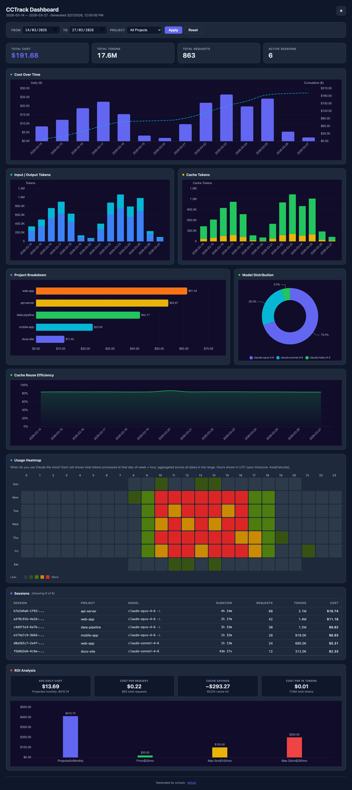
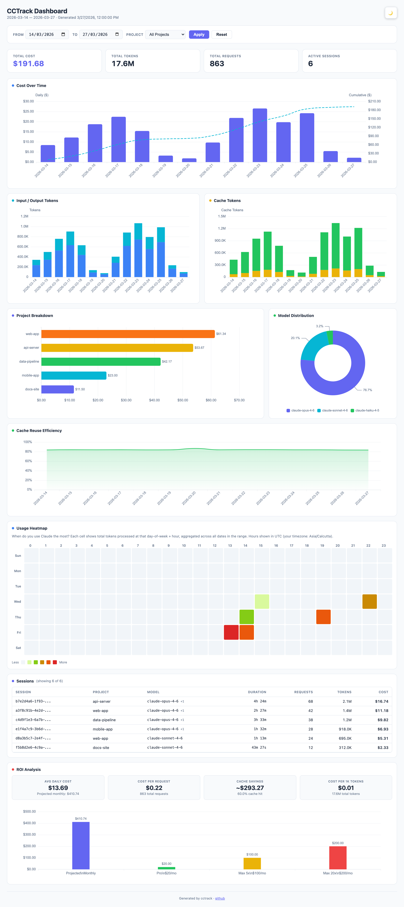

# cctrack

[](https://www.npmjs.com/package/cctrack)
[](https://github.com/azharuddinkhan3005/cctrack/blob/main/LICENSE)
[](https://nodejs.org)

Claude Code usage analytics — accurate cost tracking and a beautiful interactive dashboard from your local JSONL files.

<p align="center">
  
</p>

<details>
<summary>Light mode</summary>
<p align="center">
  
</p>
</details>

## Quick Start

```bash
npx cctrack@latest
```

Or install globally:

```bash
npm install -g cctrack
```

## Features

- **Accurate cost calculation** — 3-tier deduplication (requestId > messageId > hash), tiered pricing at 200K token threshold
- **14 Anthropic models** with 24 aliases, dynamic pricing with bundled fallback
- **Interactive HTML dashboard** — 12 panels, project/date filters, dark/light mode, ECharts charts
- **Per-project breakdown** — automatically resolves subagent paths to parent projects
- **Budget alerts** — 4-level system (safe/warning/critical/exceeded) with configurable daily/monthly budgets
- **5-hour window tracking** — usage patterns grouped by Anthropic-style time windows
- **ROI calculator** — compare API-equivalent cost against Pro/Max5/Max20 subscription plans
- **Real-time monitor** — live terminal display with burn rate projections
- **Rate limit intelligence** — tracks billable tokens (input + cache_creation, NOT cache_read)
- **Multiple output formats** — terminal tables, JSON, CSV for every command

## Commands

| Command | Description |
|---|---|
| `cctrack` | Open interactive HTML dashboard (default) |
| `cctrack daily` | Daily usage breakdown with cost sparklines |
| `cctrack monthly` | Monthly aggregated view |
| `cctrack session` | Per-session breakdown with multi-model indicator |
| `cctrack blocks` | Usage grouped by 5-hour windows (approximated, see [limitations](#known-limitations)) |
| `cctrack roi --plan max5` | ROI analysis vs subscription plans |
| `cctrack export csv` | Export per-request data as CSV |
| `cctrack export json` | Export structured JSON |
| `cctrack live` | Real-time terminal monitor |
| `cctrack statusline` | One-line output for tmux/editors (see [limitations](#known-limitations)) |
| `cctrack limits` | Rate limit analysis (billable token tracking) |
| `cctrack pricing list` | View all model prices |
| `cctrack config set budget.daily 100` | Set daily budget alert |

## Example Output

```
$ cctrack daily

┌────────────┬────────┬────────┬─────────────┬────────────┬────────┬──────────────────┐
│ Date       │  Input │ Output │ Cache Write │ Cache Read │  Total │             Cost │
├────────────┼────────┼────────┼─────────────┼────────────┼────────┼──────────────────┤
│ 2026-03-25 │  12.3K │  45.6K │        1.8M │     156.2M │ 158.1M │  $92.45 ████████ │
│ 2026-03-26 │   8.1K │  32.4K │        1.2M │      98.7M │  99.9M │  $58.30 █████░░░ │
└────────────┴────────┴────────┴─────────────┴────────────┴────────┴──────────────────┘
Daily Budget: ████████████░░░░░░░░ 58% ($58.30 / $100.00)
────────────────────────────────────────────────────────────
Total: 258.0M tokens, $150.75
Burn rate: $3.14/hr, $75.38/day → projected $2261.25/month
```

```
$ cctrack session

┌─────────────────┬─────────────┬─────────────┬──────────┬──────────┬────────┬─────────┐
│ Session ID      │ Project     │ Model       │ Duration │ Requests │ Tokens │    Cost │
├─────────────────┼─────────────┼─────────────┼──────────┼──────────┼────────┼─────────┤
│ a1b2c3d4-e5f... │ my-app      │ opus-4.6    │  18h 30m │      620 │ 210.5M │ $122.40 │
│ f6e5d4c3-b2a... │ my-api      │ sonnet-4.6  │   8h 15m │      195 │  47.5M │  $28.35 │
└─────────────────┴─────────────┴─────────────┴──────────┴──────────┴────────┴─────────┘
2 sessions, 815 requests, 258.0M tokens, $150.75
```

```
$ cctrack statusline
$58.30 today │ opus-4.6 │ 99.9M tok │ █████░░░ 52% 5h (2h 15m)
```

## Common Options

Most commands support these flags:

```text
--since YYYY-MM-DD    Filter from date
--until YYYY-MM-DD    Filter to date
--project <name>      Filter by project
--mode <mode>         Cost mode: calculate (default), display, compare
--json                Output as JSON
--csv                 Output as CSV
--breakdown           Show per-model breakdown (daily/monthly)
```

## Dashboard

Self-contained HTML file with 12 interactive ECharts panels — cost trends, token breakdown, cache efficiency, project/model distribution, usage heatmap, session table, and ROI analysis. Filter by date range and project — all panels update together.

```bash
cctrack dashboard              # Open in browser
cctrack dashboard --save report.html  # Save to file
cctrack dashboard --json       # Get raw data
```

## Budget Alerts

Set a daily spending budget:

```bash
cctrack config set budget.daily 100
```

The daily and live commands show a color-coded progress bar:

```
Daily Budget: ████████████░░░░░░░░ 62% ($62.00 / $100.00)
```

Levels: green (<50%) → yellow (50-80%) → red (80-100%) → exceeded (>100%)

## How It Works

cctrack reads Claude Code's JSONL usage logs from `~/.claude/projects/` and:

1. **Parses** entries with Zod schema validation
2. **Deduplicates** using requestId > messageId > content hash
3. **Resolves projects** from the filesystem directory structure (handles subagent paths)
4. **Calculates costs** using bundled Anthropic pricing with tiered rates
5. **Aggregates** into daily/monthly/session/project views in a single pass

## Known Limitations

cctrack is built on Claude Code's local JSONL logs and has inherent accuracy boundaries. We want to be upfront about what it can and cannot tell you.

### Billable tokens vs. total tokens

Anthropic does not count `cache_read` tokens toward rate limits — only `input` and `cache_creation` tokens are billable. cctrack's `limits` command reports billable tokens using this formula. This matters because cache-heavy sessions can show 200M+ total tokens while only 2M are actually billable. **Cost calculations use all token types at their correct per-type rates, but rate limit analysis intentionally excludes cache_read.**

### Statusline data depends on your setup

`cctrack statusline` is designed to be used as a Claude Code statusline hook (configured via `.claude/settings.json`). When configured this way, it receives real rate limit data (`used_percentage`, `resets_at`) directly from Claude Code's stdin on every assistant message. **If you run `cctrack statusline` manually from a terminal, this real-time rate limit data is not available** — you will only see cost and token data derived from JSONL logs.

### Blocks are approximations, not Anthropic's actual windows

`cctrack blocks` groups your usage into 5-hour windows to help you see usage patterns. These windows are based on your local timestamps and do not correspond to Anthropic's internal rate limit windows. Anthropic's rate limiting involves multiple overlapping systems that are not publicly documented and cannot be reconstructed from JSONL data alone.

### Rate limit prediction is uncalibrated

cctrack includes an EMA-based predictive model for rate limit estimation, but it requires calibration data (actual rate limit events) to be accurate. Most users — especially those on Max plans — rarely hit rate limits, so the model will have little or no calibration data. Treat its predictions as rough estimates, not precise forecasts.

### JSONL logs don't capture everything

- **Web usage** (claude.ai) shares the same rate limit pool but is not recorded in local JSONL files
- **Output token counts** in JSONL may undercount actual consumption in some cases
- **Plan changes** (e.g., switching from Pro to Max 5x) invalidate historical rate limit estimates
- **Extra usage credits** extend the effective limit dynamically and are not visible in logs

### Cost estimates vs. actual billing

cctrack uses Anthropic's publicly listed per-token prices. Your actual bill may differ due to volume discounts, enterprise agreements, or pricing changes not yet reflected in cctrack's bundled price table. Always verify against your Anthropic billing dashboard.

## Requirements

- Node.js >= 20
- Claude Code installed (with usage data in `~/.claude/projects/`)

## Configuration

Config stored at `~/.cctrack/config.json`:

```bash
cctrack config set budget.daily 100     # Daily budget in $
cctrack config set budget.monthly 2000  # Monthly budget in $
cctrack config get                      # View current config
cctrack config reset                    # Reset to defaults
```

## Environment Variables

- `CLAUDE_CONFIG_DIR` — Custom Claude config directory (default: `~/.claude`)

## Development

```bash
git clone https://github.com/azharuddinkhan3005/cctrack.git
cd cctrack
pnpm install
pnpm build
pnpm test           # 280 unit tests
pnpm test:e2e       # 14 browser tests
node dist/index.js daily
```

See [CONTRIBUTING.md](CONTRIBUTING.md) for the full development guide and architecture overview.

## Privacy

cctrack processes all data locally on your machine. No usage data is ever transmitted to any server. The only network request is an optional fetch of Anthropic's public pricing page to keep model prices current — no user data is sent.

## Disclaimer

cctrack is an independent open-source project and is not affiliated with, endorsed by, or sponsored by Anthropic, PBC. "Claude" and "Claude Code" are trademarks of Anthropic, PBC.

Pricing data is sourced from Anthropic's publicly available pricing page and may not reflect the most current rates. Always verify costs against your actual Anthropic billing.

## License

[MIT](LICENSE)

## Contributing

Issues and PRs welcome. Please read [CONTRIBUTING.md](CONTRIBUTING.md) and our [Code of Conduct](CODE_OF_CONDUCT.md) before contributing.
